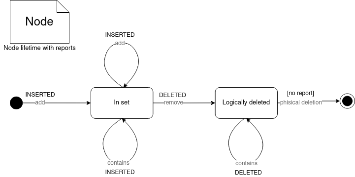

# Scinetific-iterator

# Description

$\qquad$Wait-free snapshot-based iterator for concurrent list. Implemented for lock-free list according to the article.
A lot of comments around the code contain (or consist of) pieces of the article.

$\qquad$Все комментарии в коде посвящены wait-free итератору.
Авторы статьи приводят рецепт wait-free реализации, который удалось воплотить в жизнь.

$\qquad$Основная идея итератора: когда некоторый поток начинает снимать shapshot, потоки,
изменяющие структуру данных должны предоставить report'ы об изменениях. Для поддержания порядка операций потоки-писатели должны отсылать отчёты и о "чужих уcпехах", в случаях если
1) либо требуется чтобы "чужие успехи" линеаризовались раньше соответствующих операций потоков-писателей,
2) или есть опасность, что итератор не отразит изменений других потоков. Это позволяет сделать снапшот согласованным.

$\qquad$После однократного сканирования списка целиком, параллельно собранные report'ы используются для валидизирования снапшота.

$\qquad$Главный объект во всём алгоритме снятия снапшота - SnapCollector.
Он отвечает за "коммуникацию" между потоками и одновременную линеаризацию отчетов от всех (весь секрет в CAS - операции).

$\qquad$Хранение report'ов и отсканированных узлов списка он делегирует двум хранилищам - ReportStorage и ScannerStorage соответственно.
Хранилища имеют общую внутреннюю логику основанную на известной lock-free очереди Майкла Скотта, реализованную в GenericStorage.
Сами хранилища отличаются только типом хранимых элементов.

$\qquad$Дополнительный объект Snapshotmanager отвечает за пост-обработку снапшота и призван насколько возможно логически обособить логику снятия снапшота от логики работы множества. 
А также логически пометить дополнительные операции в алгоритме lock-free множества.

# Implementation notes

$\qquad$В хранилищах собираются не значения, а ссылки на узлы. Это необходимо, чтобы использовать их как уникальные
идентификаторы,
чтобы различать разные элементы с одинаковыми значениями на этапе пост-обработки снапшота.

$\qquad$Оптимизации (по признанию авторов небольшие) из параграфа 5.2 статьи в реализации отсутствуют.

# Understanding reports
$\qquad$Почему схема report'ов именно такая? Как её такую можно было придумать? В этом заголовке попытка ответить на эти вопросы и обобщить идею на чуть более широкий класс задач.

## Report'ы наглядно
Посмотрим на жизненный цикл каждого узла в множестве в виде диаграммы:

Большими буквами подписаны типы report'ов.

$\qquad$Из диаграммы видно, что report'ы для каждого узла отправляются тогда, когда какой-то поток либо находит Node в конкретном состоянии (видит результат истории системы), либо когда модифицирует это состояние.

$\qquad$При обработке таких report'ов во время валидации снапшота сначала из несогласованного снапшота и INSERTED report'ов собираются все узлы которые были в множестве за время снятия снапшота, а затем убираются все узлы, c report'ом DELETED. Фактически это означает, что для каждого узла выясняется в каком состоянии он был на конец снятия снапшота. Логически это состояние на диаграмме. 

Само состояние фактически кодриуется битовой меткой в AtomicMarcetReference.

## Что особенного в этой диаграмме?
Что в этой диаграмме делает возможным "актуализацию" состояний узлов через  report'ы? 

1. Каждый тип report'а соответствует одному переходу (одной стрелке).
   INSERTED - In set
   DELETED - logically deleted
2. Граф состояний без циклов.
   Пусть в графе есть цикл и snap collector получил report'ы на каждое состояние цикла - тогда при таком алгоритме никак не выяснить в каком нахдоился узел в последний момент.
3. Каждая стрелка посылает уведомление в threadlocal storage.

И кажется этого достаточно, чтобы найти самое позднее состояние:

$\qquad$Пусть несколько потоков одновременно работают с объектом, удовлетворяющим этим трем условиям. Тогда после окончания приёма report'ов, в множестве репортов для каждого узла есть (неупорядоченные) переходы между состояниями. Достаточно найти среди report'ов для этого узла тот, что соответствует переходу в самое дальнее состояние на топологически отсортированном графе. Это состояние и будет искомым. 

$\qquad$Состояние в таком случае можно кодировать просто цифрой и обновлять его, например через CAS.

## Можно ли добавить циклы?
$\qquad$Можно ли снять в общем случае ограничение на циклы не ясно. В рамках текущего алгоритма это нетривиальная задача. 

$\qquad$Мешающее обстоятельство: последний report от каждого потока может попасть или не попасть в snap collector в зависимости от CAS. Но только последний и только один (спасибо threadlocal storage). Из-за этого при обработке помеченный report'ами граф состояний может содержать прорехи. Например, вслучае если два потока сделали два изменения и report попал только от более позднего.

# Sources

- lock-free set algorythm is implemented according to the book \
  Herlihy M., Shavit N. The Art of Multiprocessor Programming (220 - 226)
- iterator algorithm is implemented almost according to the article but with some restrictions. \
  Petrank E., Timnat S. Lock-free data-structure iterators //International Symposium on Distributed Computing. –
  Springer, Berlin, Heidelberg, 2013. – С. 224-238.
  https://link.springer.com/chapter/10.1007/978-3-642-41527-2_16
